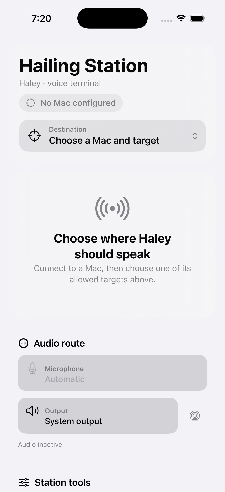
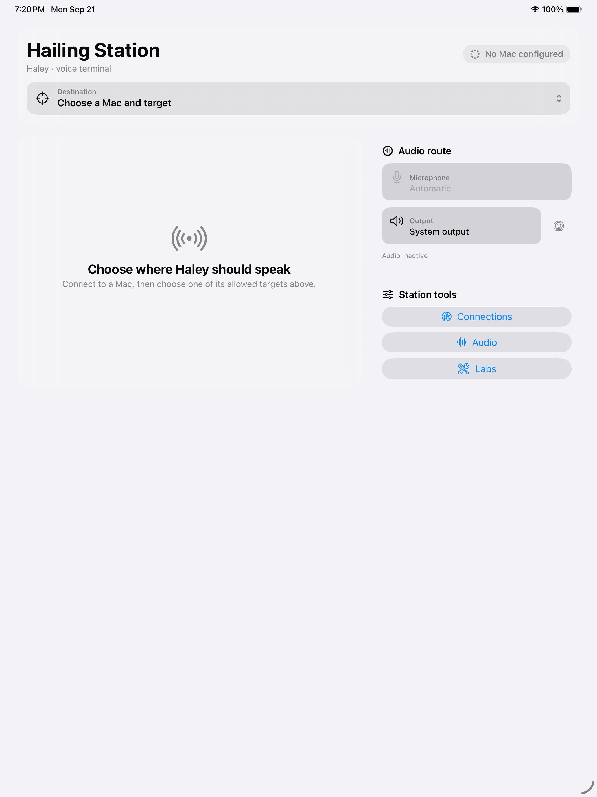

# Mobile interface

Hailing Station uses one state tree for iPhone and iPad. The interface rearranges the same destination, capture, reply, audio-route, and utility surfaces; it does not maintain separate phone and tablet products.

## Representative layouts

### iPhone, compact width

The compact layout is a single scrollable column. Connection and destination stay first, followed by the conversation, audio route, and secondary station tools. The destination browser adapts to a sheet.

### iPad, regular width

The regular-width layout keeps the conversation in the primary column and moves audio routing and station tools into a secondary column. The destination browser remains an anchored popover.

These screenshots use the sanitized unconfigured state on iOS/iPadOS 26.2 simulators. They contain no private endpoint, device, or transcript data.

## Interaction notes

- The selected Mac and target, plus connection health, remain visible above the conversation.
- Tap to talk is the primary action. A second tap stops capture, finalizes on-device transcription, and sends immediately.
- Escape remains a separate destructive action so a running host process can be interrupted without starting another utterance.
- The last transcript remains editable after sending; an edited correction is an explicit secondary action rather than a review gate.
- Microphone and output are glanceable on the station. Microphone choices use the injected audio-session controller while output uses Apple's native route picker.
- Replies retain transcript, source identity, playback state, pause/resume, replay, and mute controls.
- Connections, detailed audio diagnostics, and experimental labs remain reachable but are visually secondary.
- VoiceOver exposes stable identifiers and labels for connection, destination, audio route, talk, and playback actions.
- Light and dark appearance were visually checked. The compact surface remains scrollable at the largest accessibility Dynamic Type category, and the destination control changes to a vertical label so its value remains readable.

## Device validation

On 2026-09-21, a physical iPad on iPadOS 26.6.2 passed both of these sanitized checks with the adaptive interface:

1. Restore the remembered destination and expose the active two-column conversation without reselecting it.
2. Open the transcription lab, start capture, observe incoming audio buffers, stop capture, and return to the ready state without terminating the app.

The regular-width active view kept the selected destination, transcript editor, tap-to-talk control, Escape, audio route, and station tools visible in one screen. The automated compact-width smoke test also verified the station chrome before and after iPhone rotation.
